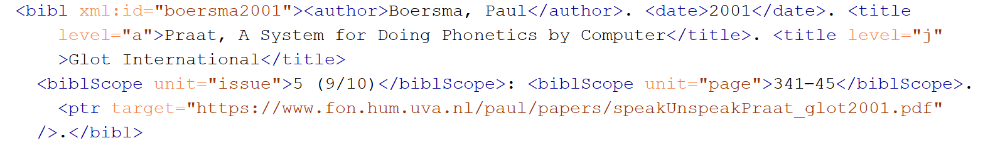
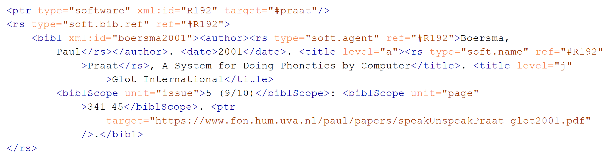
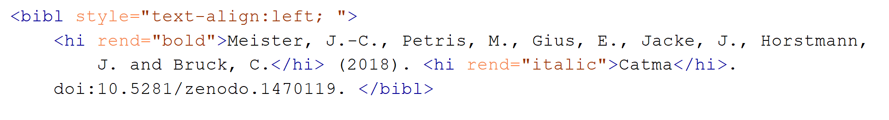
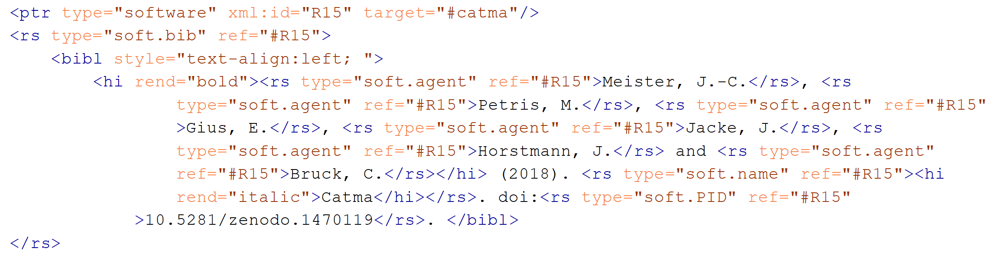
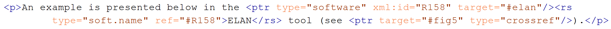
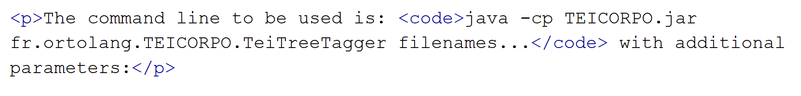
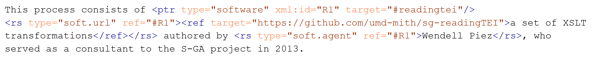
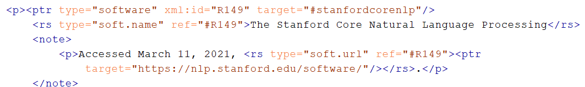
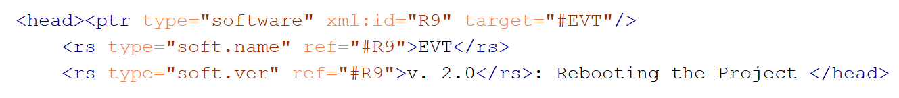

# Annotation Guidelines: Software mentions and citations 

## 1. Overview

This document presents the annotation guidelines adopted to annotate publications of the Journal of the Text Encoding Initiative. The aim of  the research is to identify what specific information is included when authors reference tools and software in their texts. 

The categories derive from previous work by the authors focused on references of software and tools in abstracts of the Digital Humanities Konferenz im deutschsprachigen Raum and the annual conference of the Alliance of Digital Humanities Organizations. The formulation of the guidelines and the workflow for their development are based on the recommendations of Nils Reiter (Reiter 2020). 

## 2. Software

The annotation focuses on identifying software mentioned in text and in what level of detail it is described. When annotating these citations, we work with a broad definition of software as any type of computer program, including desktop and web applications, server software, plugins and extensions and sets of scripts. 

This includes distinct cases of software widely used in DH, such as CLAN, oXygen, eXist-db, and Omeka. And it also includes software developed within research projects, 

### 2.1.	Programming Languages and Common Technologies

On previous stages of the research that focused on the analysis of software referencing in abstracts of Digital Humanities conferences, we observed that programming languages are often used to loosely allude to digital solutions applied to specific research tasks, therefore fitting into our understanding of research software. Admittedly, this type of referencing reflects an inaccuracy in the representation of the software/tool that was actually used. Nonetheless, we have decided to include such references to programming languages as we understand that they carry relevant information about the current practices of software referencing and describing of digital approaches to research tasks within Digital Humanities publications.

One example of such references is found in this excerpt from the Book of Abstracts of the DH 2020 Conference: “El conjunto de datos analizados se encuentra disponible en Acceso Abierto (https://doi.org/10.5281/zenodo.3893546), junto con los Jupiter Notebooks y el código Python para reproducir los análisis.” (Toscano et al. 2020). The references to Jupyter Notebooks and Python code refer to the specific tools employed in the analysis process of the research rather than to the programming language itself. However, direct references to specific programming languages such as Python or Java serve as anchors that allow for the (automatic) identification of unnamed tools.

The same criterion was applied to Content Management Systems (CMS) and Web Applications provided a specific technology is explicitly mentioned. In the excerpt below, for example, there are five different mentions of technologies and software and not all of them are annotated according to our criteria, i.e., HTML, CMS, SQL, TEI style sheets and TEI Boilerplate. The references to the markup language HTML and to “complex frameworks based on CMS and SQL” make an abstract allusion to general technologies rather than mentioning a specific software. The references to TEI style sheets and TEI Boilerplate, in contrast, refer to specific tools and should be annotated according to our schema.

>The different needs of scholars, coupled with the constant search for an effective price/result ratio and the local availability of technical skills, have led to a remarkable fragmentation: publishing solutions range from simple HTML pages produced using the TEI stylesheets (or the TEI Boilerplate software) to very complex frameworks based on CMS and SQL search engines. (del Turco et al. 2014)

## 3. Software Characterization Taxonomy

Consistent with software citation principles, we formulate the following criteria to characterize mentions of software. The criteria are modeled as a TEI taxonomy and are available on GitHub (see Jettka et al. 2022 and Henny-Krahmer and Jettka 2021 for details): 

|@type|Description|
|-----|-----|
|soft.bib|Bibliographic Entry for the software|
|soft.bib.ref|Bibliographic Entry for a reference publication about the software|
|soft.name|Name of the software|
|soft.agent|Agents involved in the development of the software|
|soft.url|URL pointing to the software|
|soft.pid|A persistent identifier for the software (PID)|
|soft.ver|Indication of a specific Software Version|
| *Table 1: Software characterization taxonomy.* |

The annotation was done on all text within the TEI-Text element including abstract, headers, legends and bibliography. Below there is a code snippet of a bibliographic entry referring to the software for phonetic analysis, Praat. According to the characterization taxonomy of mentioned software (see Table 1 above), the snippet contains a reference to an agent, Paul Boersma, to the name of the software itself, and, of course, to a reference publication about the software—the bibliographic entry itself.

*Figure 1: original snippet used in the Annotation Example 1 from Parisse et al. (2020).*

In order to annotate the code snippet according to our schema, a pointer element, <ptr/>, is created just before the software mention, in this case before the bibliographic reference. This pointer is responsible for identifying, on a more general level, that a software is being referenced and, on a more specific level, the exact software, linking is to a list of software. An xml:id value, used to link single characteristics of the software, is assigned to the pointer. Each attribute of the software is annotated within a <rs> element, which identifies the type of characterization and a ref value that links the attribute to the pointer. In the example below, Annotation Example 1, the pointer identifies the 192nd software mention within a specific publication. Then the entirety of the bibliographic reference is accordingly identified as soft.bib.ref and the further descriptive attributes “Boersma, Paul” and “Praat” are identified as soft.agent and soft.name respectively.

*Figure 2: Annotation Example 1 (Parisse et al. 2020).*

The types of characterization are defined in the taxonomy (see Table 1 above) and the ref points to the pointer (ptr/@xml:id). The pointer, in turn, collects all attributes of this specific mention of Praat and its @target attribute points to the software list containing all identified software mentioned in the annotated Journal of the Text Encoding Initiative publications as well as software previously identified in other stages of the research.

### 3.1. Soft.Bib vs. Soft.Bib.Ref

The characterizations Soft.Bib and Soft.Bib.Ref both refer to bibliographic entries in the publication and can, therefore, easily be confused. Soft.Bib is a bibliographic entry referring to the software itself; it lists the developers as authors, an URL that points to the software and, in ideal cases, a persistent identifier and the specific version. Soft.Bib.Ref on the other hand, is a bibliographic entry that identifies a reference publication, in most cases a scientific paper, about the software. Figure 1 shows a typical Soft.Bib.Ref occurrence; the bibliographic entry refers to a publication by Paul Boersma, titled “Speak and unSpeak with PRAAT”, in which he reports on the functionalities and use cases for the software PRAAT, developed by him and Vincent van Heuven. Figure 3 (see below) conversely shows a bibliographic entry that refers directly to a publication of the software Catma on Zenodo, being therefore classified as Soft.Bib.

*Figure 3: original snippet used in the Annotation Example 2 from Adelmann et al. (2019).*

Annotation for the snippet shown above would be carried out just as shown in Annotation Example 1. Each of the agents is individually tagged with a <rs> element. The name of the software and the persistent identifier are also accordingly tagged (see Annotation Example 2 below).

*Figure 4: Annotation Example 2 (Adelmann et al. 2019).*

Both in cases of Soft.Bib and Soft.Bib.Ref it is important to annotate not only the bibliographic entry itself but also all the specific information that might be contained in the reference, such as agents, PID, URL and version.

### 3.2. Soft.Name

Most occurrences of software are based solely on the mention of a name, as it is shown in Annotation Example 3 below. This often occurs within the context of a sentence or paragraph and in these cases the pointer element is inserted immediately before the name of the software. The name of the software is then accordingly tagged within the <rs> element.

*Figure 5: Annotation Example 3 from Parisse et al. (2020).*

The automatic annotator used in the first stage of the workflow does not differentiate between different textual elements, such as figure legends or code snippets, since it matches the occurrences of software names already registered in the software list. In the manual annotation stage, we have opted to tag all software mentions that occur within the <text> element, not differentiating between the textual parts. According to this criterion, we also annotate code snippets such as the one shown below:

*Figure 6: code snippet with software mentions from Parisse et al. (2020).*

### 3.3. Soft.Agent

When the software mention includes the naming of the developer(s) involved, they should be identified with the <rs> element of type Soft.Agent. These are often identified as authors in bibliographic entries of the Soft.Bib type or explicitly characterized as such in the text body. In the following text excerpt, there is a reference to an unnamed tool identified as a “set of XSLT transformations” and also by the developer: “This process consists of a set of XSLT transformations authored by Wendell Piez, who served as a consultant to the S-GA project in 2013”( Muñoz et al. 2014). The tool in question is Reading TEI, as can be inferred from the URL within the <ref> element. The annotation of the excerpt would be carried out in the following manner:

*Figure 7: Annotation Example 4 from Muñoz et al. (2014).*

Note that, in this case, the <ref> element and its attributes were already a part of the original document provided by jTEI.

### 3.4. Soft.URL

URLs that point directly to the software’s website should be identified as Soft.URL. Note that URLs that point to a reference publication about a software should not be identified as Soft.URL.
In the example given above, the URL is given as the content of the attribute target of the reference element, <ref>. In this case, the identifying tag used for annotating the software mentions and their characterizations, the referencing string, should wrap <ref> and its content. In jTEI publications the URL is also usually given in a pointer element, <ptr>, in which cases the same approach of wrapping with the annotation tags is to be adopted.

*Figure 8: Annotation Example 5 from Parisse et al. (2020).*

Annotation Example 5 above shows the characterization of the software Stanford Core NLP with a URL given in the notes within a pointer element. The annotated URL refers to the software which is named outside of the <note> element, connected by the id given in the xml:id and ref attributes in the pointer and referencing string respectively.

### 3.5. Soft.PID

Persistent identifiers, such as DOIs, are identified as Soft.PID. Similarly to occurrences of URLs, it is important to check that the PID identifies the software and not a reference publication.
In Annotation Example 2 (see Figure 4 above), the software Catma is referenced as a bibliographic reference and accordingly identified with its DOI. We annotate this DOI with a <rs> string of type Soft.PID.

### 3.6. Soft.Ver

Referring to the specific version of a software used within a research setting can be highly relevant for enabling reproducibility. When a software is characterized with a version, it should be identified as Soft.Ver. The text identified should include all alphanumeric characters belonging to the version, including abbreviations of the word “version” as in, for example, “v.2.0”.

*Figure 9: Annotation Example 6 from del Turco et al. (2014).*

## 4.	Special Cases

Not all software references found in the analyzed publications are uncomplicated and easily fit the annotation schema outlined here. In this section, we will go over examples of software mentions which presented a challenge or complex annotation scenarios and the solutions we adopted.

### 4.1. Unnamed Software

We have observed that oftentimes software are loosely mentioned without ever being named. Our annotation schema is based on the identification of several possible attributes associated with software (see Table 1 above), the most common of which being the name. When a software is identified, a pointer is added to the text and all attributes associated with that mention are associated with the pointer. Our model addresses the matter of software referencing and how to annotate mentions in its varying degrees of detail; from a technical perspective, defining a pointer to which no attribute is associated is ineffective. We have opted not to annotate vague software mentions that are accompanied by no identifying attribute, see the example below:

>S-GA is developing and deploying a viewer for SharedCanvas that uses HTML5 technologies to display document-focused TEI elements that are mapped as annotations to a SharedCanvas manifest, a Linked Open data graph that ties all the SharedCanvas components together. (Muñoz et al. 2014)

In the text excerpt above, the authors mention a software in development but no explicit characterization, such as the name, developers involved or even a version is given in the text. Due to the impossibility of annotating the excerpt based on the information present in the text alone, we opt to not annotate such occurrences.

Nonetheless, we are aware that the possibility of annotating abstract software mentions would lead to insightful information about overall practices of software referencing and the contexts in which a proper characterization is granted. For the current version of the annotation schema, we have not included such cases but we plan to adapt our model in the future to be able to explore more complex and nuanced software references.

### 4.2. Software citation components split between text, footnote and bibliography

Often there is no clear recommendation for how software should be referenced in scientific publications, as a consequence, there is a wide variety of in the ways software are mentioned and characterized in these publications. A common way of giving further details about something mentioned in the body of a text without deviating too much from core arguments is to add a footnote. For the purposes of this annotation schema, we consider the footnote to be an extension from the text excerpt it derives from. In such cases the pointer element is added before the first occurring citation component, usually a software name, and all further components refer back to the pointer in the body of the text, including those present in the footnotes. Annotation Example 5 (see Figure 8 above) depicts one such case: the URL of Stanford Core NLP is given in a footnote and accordingly annotated with the <rs> element pointing back to the <ptr> element given in the body of the text, right before the first citation component (i.e., the name of the software) occurs.

### 4.3. Mentions of tools not framed as software

In the different stages of our analysis, we found highly varying contexts in which authors mention software. In many cases, tools 

>En relación con los recursos que los participantes utilizan para enseñar o aprender la TEI, dimos las siguientes opciones: 1. Tutoriales y recursos en línea; 2. TEI By Example; 3. TTHub; 4. DARIAHTeach; 5. Materiales proporcionados por instructores; 6. Artículos académicos; 7. Recursos del sitio web TEI-C, y 8. Otros. (del Riande et al. 2023, emphasis added by the authors)

123

>Online tools they claimed to have used included OxGarage, Roma, TEI by Example, and the TEI Guidelines, as well as the university-hosted resources published by the Brown University Women Writers Project (Bauman and Flanders 2013) and Humboldt University in Berlin. (Dee 2014)

123

## References
Adelmann, Benedikt; Andresen, Melanie; Begerow, Anke; Franken, Lina; Gius, Evelyn; Vauth, Michael (Eds.) (2019): Evaluation of a Semantic Field-Based Approach to Identifying Text Sections about Specific Topics. Zenodo.

Dee, Stella (2014): Learning the TEI in a Digital Environment. In jtei (Issue 7). DOI: 10.4000/jtei.968.

Del Riande, Gimena Rio; Allés-Torrent, Susanna (2023): ¿Quién conforma la comunidad de la TEI en español? Análisis de los datos de una encuesta. In jtei (16). DOI: 10.4000/jtei.4927.

Henny-Krahmer, Ulrike; Jettka, Daniel (2021): Softwarezitation in den Digital Humanities. (Version 0.1). Zenodo. http://doi.org/10.5281/zenodo.5106.

Jettka, Daniel; Henny-Krahmer, Ulrike; Ferger, Anne; Alvares Freire, Fernanda (2022): Software citation in the Digital Humanities. (Version 0.1) GitHub.com. https://github.com/DH-RSE/software-citation [last accessed: 04.11.2022]

Muñoz, Trevor; Viglianti, Raffaele (2014): Texts and Documents: New Challenges for TEI Interchange and Lessons from the Shelley-Godwin Archive. In jtei (Issue 8). DOI: 10.4000/jtei.1270.

Parisse, Christophe; Etienne, Carole; Liégeois, Loïc (2020): TEICORPO: A Conversion Tool for Spoken Language Transcription with a Pivot File in TEI. In jtei (Issue 13). DOI: 10.4000/jtei.3464.

Reiter, Nils (2020): Anleitung zur Erstellung von Annotationsrichtlinien. In Nils Reiter, Axel Pichler, Jonas Kuhn (Eds.): Reflektierte algorithmische Textanalyse: De Gruyter, pp. 193–202.

Toscano et al. (2020): Evolución y escenario actual de las Humanidades Digitales en España. In: Laura Estill, Jennifer Guiliano, and Constance Crompton eds. DH2020 Book of Abstracts. 

Del Turco, Roberto Rosselli; Buomprisco, Giancarlo; Di Pietro, Chiara; Kenny, Julia; Masotti, Raffaele; Pugliese, Jacopo (2014): Edition Visualization Technology: A Simple Tool to Visualize TEI-based Digital Editions. In jtei (Issue 8). DOI: 10.4000/jtei.1077.
